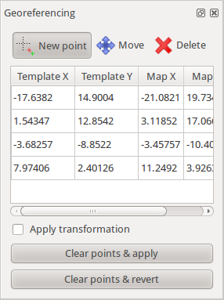

Users of existing (commercial) map drawing software should be able to use Mapper without much learning.

In the following, the proposed design is illustrated with a mixture of screenshots and sketches. 

On startup, the program shows a home screen to provide a starting point to new users: 

 

  
The new map dialog offers to set the map scale and choose a symbol set: 

 

  
When a map is loaded, the main window looks like this: 

 

  
Here, most of the time using the program is spent, as it is the central place for editing a map. Symbols can be selected in the symbol browser and drawn as map objects using one of the drawing tools from the toolbar. Additionally, the toolbar contains editing tools to refine the map objects, for example by rotating them or cutting holes into them. The status bar shows usage information about the currently selected tool, for example “C**lick**: set point. C**lick and drag**: set point and specify its rotation. **Shift**: snap to other objects”. 

  
There are some **dock windows** which can be shown and hidden using the menu and which can be freely positioned inside the main window. The symbol browser is one of them. Next is a list of all planned dock windows with a description of their use: 

  
**Grid configuration window**

  
Allows to configure a helper grid which is shown below the map and above the templates. Note that the action to show and hide the grid is separate from the settings window. It is contained in the main window menu and its toolbar. 

  
 

The settings should be self-explanatory. 

The distance input widgets can be toggled to accept millimeters on map or meters in reality. 

  
**Symbol window**

Here, symbols are displayed in a grid view and they can be selected. Ctrl+click selects multiple symbols, Shift+click selects a continuous sequence of symbols. 

The symbol preview images are not separate raster images, but they are generated directly from the symbol definition. If this leads to some indistinguishable symbols, some options to influence the design of the preview image or use a raster image as an exception could be introduced. 

  
The right-click context menu in this widget is as follows. 

Notation for menus: 

[ ] is prepended to checkable items 

[X] items are checked by default 

“---” represents a separator 

  

  * New 
    * Point 
    * Line 
    * Area 
    * Text 
    * Combined 
  * Edit 
  * \--- 
  * (Change selected object(s) to): _Changes the symbols of the selected objects to the clicked one, only available if objects are selected whose symbols can be converted to this one_
  * (Fill / create border for selected objects)
  * \--- 
  * Copy 
  * Paste 
  * Duplicate 
  * Delete 
  * \--- 
  * [ ] Hide objects with this symbol 
  * [ ] Protect objects with this symbol from editing 
  * \--- 
  * Select 
    * All symbols 
    * Used symbols 
    * Unused symbols 
    * Invert 
    * All objects with the selected symbol(s) 
  * Sort 
    * By color 
    * By number 

  
**Color window**

  
 

  
**Layer window**

  
 

Map objects can be arranged into layers. The word 'layer' is a bit misleading because these are not drawn on top of each other, instead it is simply a way to organize objects into separate groups. For example, there could be a layer 'map' and a layer 'decoration' containing the title, frame, legend, etc. – are there any better naming suggestions? 'Group' is already used elsewhere. 

Another use of layers could be to separate the drawings of two or more persons working on a map simultaneously. Each person could draw in his/her own layer and import the layers of the other person(s) separately to get an up to date map. 

Layers could also help to make multiple map excerpts using a single map file (which makes it easier to update the map). This could be done by grouping the objects correctly and then activating a set of layers to print one excerpt, and activate another group of layers (overlapping with the first) to print another excerpt. 

  
**Template setup window**

  
 

Here, templates can be loaded and their properties adjusted. Templates higher in the list are drawn on top of the lower templates. There is a special item “- Map -”. If a template is moved above this item, it is drawn on top of the map. 

Templates can be grouped. When this is done, they stay “attached” to each other, so if one of them is moved, the other templates in the group will follow its movement. This could for example be handy if multiple visualizations are generated from a laserscanning data file, covering the same area. If they are grouped, all of them can be moved at once. 

The “More...” button on the lower right shows operations which are specific to the type of template, for example tracing lines for raster image templates. 

The following types of templates are planned: 

  * Raster image templates 
  * GPS track templates 
  * Map templates (load another map file as template) 
  * Sketch templates (endless canvas for the “draw on template” feature) 

In addition, it would be nice if it was possible to load a laserscanning file directly to generate templates from it. Another idea is to implement support for web map services such as OpenStreetMap. 

  
**Georeferencing**

  
 

This window can be shown from the template setup window and is used to adjust the transformation of a template by setting pass points. 

“[ ] Apply transformation” toggles if the original transformation or the adjusted transformation is used for display. 

“Clear points and ...” deletes all pass points and keeps either the original or the adjusted transformation. 

  
**Template configurations window**

  
 

  
This window allows to define “template configurations”. Every template configuration specifies visibility information for all templates. For example, one configuration could be “show ortho photo with contours on top”, another one “show old o-map”, another one “show laserscanning relief with contours on top”, etc. Template configurations allow to switch between these configurations quickly by selecting them from a list or by using keyboard shortcuts. 

The shortcut can be set by clicking “Set shortcut” and pressing the desired key combination. The current shortcut is displayed in brackets on this button. 

  
**Template visibilities window**

  
 

This small dock window provides a way to set the template visibilities directly and quickly without having to leave the large template setup window open. 

  
**GPS window**

  
This window makes it possible to start live GPS display, record GPS tracks to a file (GPS template) and average GPS positions over time to get a more accurate position to set a point object or wayoint there. 

 

There is no sketch for the receiver selection &amp; setup window yet as it will first have to be determined which possibilities there are for settings, data sources etc. 

On click, the two buttons at the bottom immediately start recording data and open a separate window to select a 

  * line symbol for recording lines 
  * point symbol (and possibly rotation if the symbol is not oriented to north) for recording points 
  * name for setting a waypoint 

For the points, the data is averaged until this separate window is closed again. 

  
The proposed **menu structure** for the **main window** follows. 

File 

  * New 
  * Open 
  * Recent files → 
  * Save 
  * Save as... 
  * \--- 
  * Print or export... 
  * \--- 
  * Close 

Edit 

  * Undo 
  * Redo 
  * \--- 
  * Cut 
  * Copy 
  * Paste 
  * \--- 
  * (Convert to path) _for circles, ellipses, rectangles and possibly also text_
  * (Create rounded rectangle) _for rectangles_
  * \--- 
  * Group: _Creates a group from a set of multiple selected objects which is then handled as a unit_
  * Ungroup 
  * \--- 
  * Preferences... 

View 

  * [ ] Show helper grid 
  * [ ] Grid configuration window 
  * Set viewports 
    * Single viewport 
    * Two viewports: _left, right_
    * Three viewports: _top left, bottom left, right_
    * Four viewports: g_rid_
  * \--- 
  * Set custom zoom factor... 

Symbols 

  * [X] Symbol window: _shows or hides the symbol dock window_
  * [ ] Color window: _shows or hides the color definition dock window_
  * \--- 
  * Load symbols from: _loads symbols from another map file_
  * Load colors from: _loads colors from another map file_
  * Scale all symbols 
  * Delete unused symbols 
  * Change all symbols of specific type:_ changes all objects having one of the selected symbols to a different symbol_

Map 

  * [ ] Layer window: _allows to manage map layers_
  * \--- 
  * Change map scale... 
  * Rotate map... 
  * \--- 
  * Create map excerpt... 

Templates 

  * [ ] Template setup window: _shows a dock window where templates can be loaded and configured_
  * [ ] Template configurations window: _shows a dock window to manage template configurations_
  * [ ] Template visibilities window: _shows a small dock window where template visibilities can be adjusted quickly_
  * \--- 
  * Open template...: _shortcut to load a template_
  * [ ] Hide all templates 

GPS 

  * [ ] GPS window: _shows a dock window where live GPS display can be configured_
  * \--- 
  * Edit projection parameters... 

Help 

  * Open manual 
  * \--- 
  * About 
  * About Qt 

  
The **main window toolbar** contains the following items: 

View 

  * [ ] Display grid 
  * [ ] Hide all templates 
  * Show whole map 

Snap 

  * [X] Snap to grid 
  * [X] Snap to path endpoints 
  * [ ] Snap to inner path points 
  * [X] Snap to object boundaries 

Drawing 

  * Edit tool (for objects and their control points) 
    * _When this tool is active, the selected object(s) are highlighted. In addition, their rectangular extent (bounding box) is visualized. If only a single object is selected, its control points are displayed in addition.On the outer side of the bounding rectangle, small arrows are drawn which allow to scale the object(s) when dragged. If the bounding box is clicked without dragging, these arrows switch direction so the object can now be rotated with them (see Inkscape)._
    * Left click on object 
      * without modifiers: select object 
      * with Shift: multiple object selection 
      * with Ctrl: subdivide path to add new control point 
      * with Ctrl and Space: subdivide path to add new dash point 
    * Left click on control point: select control point 
      * with Shift: multiple control point selection 
      * with Ctrl: delete control point 
    * Left click and drag on bounding box(es) of object(s): move object(s) 
    * Left click and drag on control point(s): move control points 
      * with Shift: toggle snapping 
      * with Ctrl: constrain direction 
    * Left click and drag on whitespace: box select 
      * with Shift: switch selection 
      * with Ctrl: box select control points 
  * Point setting tool 
    * Left click: set point 
      * with Shift: toggle snapping 
    * Left click and drag: set point and specify its direction for symbols which are not oriented to north 
      * with Ctrl: constrain direction 
  * Path drawing tool 
    * Left click: set corner point 
    * Left click and drag: set curve point 
      * with Shift: toggle snapping. If snapping to another path and dragging the mouse, follow that path. If beginning to draw at the endpoint of another path with the same symbol, append the new path. 
      * with Ctrl: constrain direction 
    * Double click, right click, enter, escape: finish / close path or abort drawing 
    * Backspace: undo last control point 
  * Circle drawing tool 
    * _Draws circles. These can be further edited as circles or converted to paths by using the corresponding action in the Edit or context menu._
    * Left click: set midpoint and open radius input window 
    * Left click and drag: specify two opposite points on the circle (first point: drag start point, second point: drag end point) 
  * Ellipse drawing tool 
    * _Draws ellipses. These can be further edited as ellipses or converted to paths by using the corresponding action in the Edit or context menu._
    * Left click: set midpoint and open radius + angle input window 
    * Left click and drag, first time: specify first axis of ellipse 
    * Left click and drag, second time: specify second axis of ellipse 
  * Rectangle drawing tool 
    * _Draws rectangles. These can be further edited as rectangles or converted to paths by using the corresponding action in the Edit or context menu._
    * Left click: set corner point 
      * with Shift: toggle snapping 
      * with Ctrl: constrain direction 
    * Double click, right click, enter, escape: finish rectangle or abort drawing 
  * Text drawing tool 
    * _Draws text. It can be further edited as text or converted to paths by using the corresponding action in the Edit or context menu._
    * Left click: set start position of text 
    * Left click and drag: set bounding box of text (this enables automatic word wrap) 
  * Numeric object creation tool 
    * Left click: set start point and open the input window where the type of object to create can be selected and its parameters entered, for example direction and length for a line. 

Common editing (of selected object(s)) 

  * Duplicate 
  * Change symbol 
  * Fill a line or add a border to an area
  * Flip side of objects on lines 
  * Union areas or connect paths 
  * Cut into pieces 
  * Cut hole into object 
  * Rotate around point 

Less common editing (of selected object(s)) 

  * Grow / shrink using object normal 
  * Change layer 
  * Intersection 
  * Difference 
  * Distribute object on path 
  * Subdivide path 

Other 

  * Measure distance 
  * Get GPS coordinates of point 
  * Draw on template 

  
**Right-click context menu** when clicking on the map 

Idea: instead of showing a traditional list-based menu, a ring menu could be shown with the cursor as its center, allowing to reach important operations faster. 

The positioning of the operations and which of them to show would then be configurable in the program settings. 

Examples for useful actions in the ring menu: 

  * Convert object to path 
  * Cut tool 
  * Edit tool 
  * Default drawing tool for this symbol type 

  
**Program preferences**

The exact layout will depend on which settings will be made available, but at least there have to be possibilities to: 

  * Set basic options, such as 
    * Set display dpi to be able to display zoom levels correctly 
    * Snapping on or off by default? 
    * Use antialiasing for drawing? 
    * Set click threshold 
    * Show home screen or open last map on startup? 
    * … 
  * Set keyboard shortcuts, which should be possible for all actions (!) 
